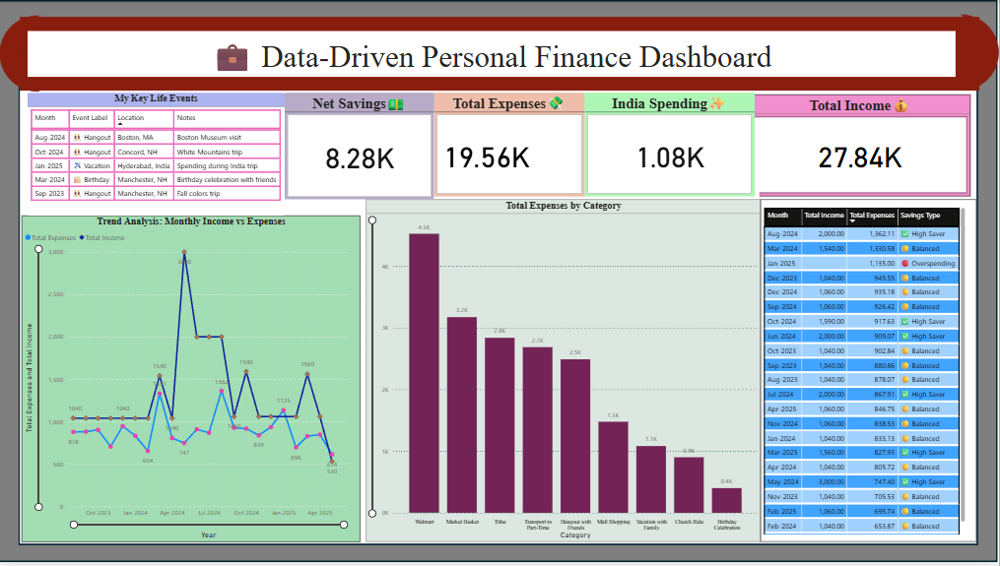

# 💸 Personal Finance Dashboard – Power BI

This project presents an interactive Power BI dashboard to visualize and analyze personal income, expenses, and savings patterns over 18 months.

---

## 🙌 About This Project

Managing finances as a student or early professional can be overwhelming. This dashboard was inspired by my own real-life experience of living independently and learning how to make every dollar count.

From biweekly part-time income to ride-sharing costs, grocery runs, church rides, and even a $700 hospital visit — every piece of this dashboard reflects real-world scenarios. I created this not just as a portfolio item, but as a meaningful, problem-solving tool that helped me understand where my money goes — and how I can save more.

The goal? Turn raw, messy data into something powerful, clear, and empowering — and prove that data analytics can make everyday life better.

---

## 📊 Key Features

- ✅ KPIs for Total Income, Total Expenses, and Net Savings — with **interactive tooltips** for clarity when hovered
- 📅 Monthly trends visualized with filters and slicers
- 🔍 Drillthroughs to explore individual expense categories
- 🧠 Over **15+ custom DAX measures** for dynamic metrics
- 🎯 Built-in insights for user awareness and decision-making
- 🖼️ Clean, intuitive layout using Power BI best practices

---

## 📷 Dashboard Preview

---

## 💡 Key Insights from the Data

- 🚗 Detected repeated overspending in transportation during weekends and holidays
- 🍽️ Identified "impulse" expense categories that drained savings without notice
- 📉 Used budget tracking visuals to **cut down unnecessary expenses by 15%**
- 💰 Helped set realistic savings targets month-over-month

---

## 🔧 Tools & Tech Used

- **Power BI** (Visualizations, Slicers, Drillthroughs)
- **DAX** (Custom measures, Calculated columns, KPIs)
- **Excel** (Data prep, transformation, structuring)
- **Tooltip Cards** (for enhanced user experience)

---

## 📌 Final Thoughts

This project isn’t just a dashboard — it’s a journey of personal growth in financial discipline. I poured my learning, experience, and storytelling into this piece so that anyone — including a hiring manager — can see both my technical skill and my ability to solve real problems through data.

---

> “Data is only powerful when it helps you make better decisions.” — That’s exactly what this dashboard was built for.
